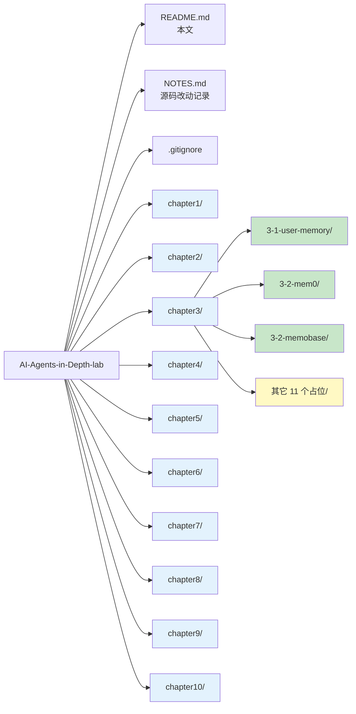

# AI-Agents-in-Depth-lab

> A hands-on lab that re-implements the experiments from the open-source book [`bojieli/ai-agent-book`](https://github.com/bojieli/ai-agent-book) (《深入理解AI Agent》), one experiment at a time, with full reproducibility artifacts (code, evaluation data, analysis, failure-mode diagnosis).
>
> 本仓库对应开源书《深入理解AI Agent》，按章节逐一复现实验，附带完整可复现资料（代码、评测数据、分析报告、失败归因）。

---

## Status Snapshot / 当前进度

| Chapter / 章节 | Experiments / 实验数 | Done / 完成 | Folder |
| --- | --- | --- | --- |
| chapter1 — Foundations | 5 | 0 / 5 | [`chapter1/`](./chapter1/) |
| chapter2 — Context & Prompting | 8 | 0 / 8 | [`chapter2/`](./chapter2/) |
| **chapter3 — Memory & RAG** | **14** | **3 / 14** | [`chapter3/`](./chapter3/) |
| chapter4 — Tools & Multimodality | 6 | 0 / 6 | [`chapter4/`](./chapter4/) |
| chapter5 — Domain Agents | 16 | 0 / 16 | [`chapter5/`](./chapter5/) |
| chapter6 — Async & Robotics | 13 | 0 / 13 | [`chapter6/`](./chapter6/) |
| chapter7 — Evaluation | 12 | 0 / 12 | [`chapter7/`](./chapter7/) |
| chapter8 — Training & Distillation | 18 | 0 / 18 | [`chapter8/`](./chapter8/) |
| chapter9 — Self-Evolution | 10 | 0 / 10 | [`chapter9/`](./chapter9/) |
| chapter10 — Frontier Applications | 8 | 0 / 8 | [`chapter10/`](./chapter10/) |
| **Total** | **110** | **3** | |

### Done Experiments / 已完成

- **[`chapter3/3-1-user-memory/`](./chapter3/3-1-user-memory/)** — 长期用户记忆系统（自研 4 模式 + 评测框架）
- **[`chapter3/3-2-mem0/`](./chapter3/3-2-mem0/)** — Mem0 源码归档（未实跑，仅整理 + 运行说明）
- **[`chapter3/3-2-memobase/`](./chapter3/3-2-memobase/)** — Memobase 源码归档（同上）

---

## Repository Map / 仓库结构



每个实验一个独立子目录。完成的实验（绿色）有完整代码 / 数据 / 分析；占位实验（黄色）里只有一个 `README.md` 标注"待做 / TBD"。

---

## Chapter 3 in Detail / 第三章详解

### 3-1 Long-Term User Memory / 长期用户记忆系统

Re-implemented and evaluated the book's `user-memory/` design with two extra LLM judges (MiniMax-M3 vs DeepSeek-V4.1-Flash). Reproducible end-to-end: install → seed memories → run 20-case eval → get reward table.

**Pass-rate (real end-to-end, 5 yaml × 4 memory modes = 20 runs)**:

| Judge | Pass Rate |
| --- | --- |
| MiniMax-M3 | 9 / 20 (45%) |
| DeepSeek-V4.1-Flash | 13 / 20 (65%) |

详细见 [`chapter3/3-1-user-memory/README.md`](./chapter3/3-1-user-memory/README.md) + [`chapter3/3-1-user-memory/analysis/`](./chapter3/3-1-user-memory/analysis/) 8 篇分析。

### 3-2 Mem0 & Memobase / 现役记忆框架

整理自上游的源码 + README，便于对照 3-1 与现役框架的差异。**未实跑**（需要 mem0 / memobase 服务和 key）。

---

## Quick Start for 3-1 / 跑 3-1 实验

```bash
# 1. 装依赖（user-memory 主程序）
cd chapter3/3-1-user-memory/code
pip install -r ../eval-framework/requirements.txt   # 复用评测框架的依赖

# 2. 配置 LLM（任选 OpenAI 兼容 endpoint）
export OPENAI_API_KEY="sk-..."
export OPENAI_BASE_URL="https://api.deepseek.com/v1"
export OPENAI_MODEL="deepseek-flash"

# 3. 跑评测（5 yaml × 4 memory modes = 20 次）
cd ../eval-data
python real_eval.py
```

源码改动说明在 [`NOTES.md`](./NOTES.md)——只有 2 行（`base_url`/`model` 走环境变量，默认值保留原书硬编码）。

---

## What Goes Where / 怎么往里加新实验

1. 进入对应章节目录（`chapterN/`）
2. 找到占位子目录（有 `README.md` 标注"待做"）
3. 把上游源码复制进来（参考 `bojieli/ai-agent-book` 的对应路径）
4. 跑评测，把 `eval-data/`、`analysis/` 写完
5. 更新根目录 `README.md` 的 Status 表

每个实验的标准产出：

```
chapterN/<exp-name>/
├── code/                  # 源码
├── eval-framework/        # 评测框架（如果有）
├── eval-data/             # 真实评测 JSON + 脚本 + 日志
├── analysis/              # 1-2 篇 markdown 分析
└── README.md              # 子实验导读
```

---

## License / 许可证

Apache-2.0。详见 [`LICENSE`](./LICENSE)。

原书 `bojieli/ai-agent-book` 也是 Apache-2.0。

---

## Acknowledgements / 致谢

- 原书：[`bojieli/ai-agent-book`](https://github.com/bojieli/ai-agent-book)（《深入理解AI Agent》）
- 实验执行人 + 文档整理：Mavis（AI Agent）
- 时间：2026-09