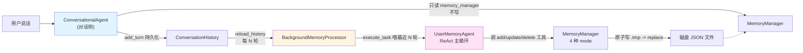

# 实验 3-1：长期用户记忆系统

> 对应 `ai-agent-book/chapter3/user-memory/`（实验 3-1 + 3-2）。

## 实验目标

实现一个"对话侧 + 后台处理器"的**分离式记忆架构**：

- 对话侧（ConversationalAgent）：实时回答用户问题，**只读**记忆（绝不写）
- 后台处理器（BackgroundMemoryProcessor）：异步监听对话历史，**只写**记忆（绝不答）
- 中间层（MemoryManager）：4 种记忆模式（notes / enhanced_notes / json_cards / advanced_json_cards）

## 整体架构



## 4 个核心文件

| 文件 | 职责 |
| --- | --- |
| [`code/conversational_agent.py`](./code/conversational_agent.py) | 对话侧——只回答，只读记忆 |
| [`code/background_memory_processor.py`](./code/background_memory_processor.py) | 后台侧——只写记忆 |
| [`code/agent.py`](./code/agent.py) | 共享的 ReAct Agent（被后台侧调用来调工具） |
| [`code/memory_manager.py`](./code/memory_manager.py) | 4 种存储模式实现 |

辅以 `conversation_history.py`、`config.py`、`main.py`（演示入口）。

## 4 种记忆模式

| 模式 | 存储 | 强制 schema | 关键区别 |
| --- | --- | --- | --- |
| `notes` | 字符串笔记列表 | 无（最自由） | 易乱 |
| `enhanced_notes` | 与 `notes` 同存储 | 无（prompt 强制段落） | 切模式不迁移 |
| `json_cards` | 3 层 `category.subcategory.key=value` | 路径 = memory_id | 只能存键值对 |
| `advanced_json_cards` | 2 层 `category.card_key=任意 JSON` | 强制 `backstory / person / relationship / date_created` | L2/L3 消歧核心 |

## 评测

我们用 `user-memory-evaluation/` 框架做评测，60 个 yaml 用例分 3 层：

- **Layer 1**（20 个）：单会话基础回忆（最简单）
- **Layer 2**（20 个）：跨会话多对象消歧（中等）
- **Layer 3**（20 个）：跨会话主动服务（最难）

### 评测结果总览（真实跑 5 用例 × 4 mode = 20 次）

| 模型 | 通过率（≥0.6）|
| --- | --- |
| MiniMax-M3 | 9/20（45%） |
| DeepSeek-V4.1-Flash | 13/20（65%） |

详细数据在 [`eval-data/`](./eval-data/)。

## 文件目录

| 子目录 | 内容 |
| --- | --- |
| [`code/`](./code/) | 8 个核心 Python 源码 + README + PROVIDERS |
| [`eval-framework/`](./eval-framework/) | 6 个评测框架源码 + 60 个测试用例 + fixtures |
| [`eval-data/`](./eval-data/) | 真实评测数据（DeepSeek + MiniMax）+ 评测脚本 |
| [`analysis/`](./analysis/) | 8 篇分析报告（按时间顺序） |
| [`comparison-minimax-vs-deepseek/`](./comparison-minimax-vs-deepseek/) | MiniMax vs DeepSeek 对比 |

## 跑实验

详见 [`../../../README.md`](../../../README.md) 的 quick start 章节 + [`../../../NOTES.md`](../../../NOTES.md) 的源码改动说明。

简要：

```bash
export OPENAI_API_KEY="sk-..."
export OPENAI_BASE_URL="https://api.deepseek.com/v1"
export OPENAI_MODEL="deepseek-flash"
cd eval-data && python real_eval.py
```