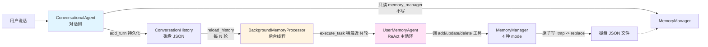

# 3-1 实验进展（第一次更新）

## 我们做了什么

1. **克隆仓库**：`https://github.com/bojieli/ai-agent-book`，加了 `--depth=1` 加速
2. **找到 3-1 实验**：`chapter3/user-memory/` — 长期用户记忆系统（4 个核心文件）
3. **理解架构**：对话侧 + 后台处理器 + ReAct Agent + 4 种记忆模式（见下）
4. **跑离线 keyword-recall**：8 条用例（fixtures 里只有 8 条预设回答）
5. **跑 LLM judge demo**：MiniMax-M3 当评委，跑通；评分合理
6. **正在跑**：完整 32 条 LLM judge 对比（4 系统 × 8 用例）

## 整体数据流（mermaid）

## 4 种记忆模式渐进

| 模式 | 存储 | 强制 schema | 适用场景 |
| --- | --- | --- | --- |
| `notes` | 字符串笔记列表 | 无（最自由） | 先跑通、易乱 |
| `enhanced_notes` | **与 notes 同存储** | 无（prompt 强制段落） | 切模式不迁移 |
| `json_cards` | 3 层 `category.subcategory.key=value` | 路径 = memory_id | 只能存键值对 |
| `advanced_json_cards` | 2 层 `category.card_key=任意 JSON` | 强制 `backstory / person / relationship / date_created` | **L2/L3 消歧核心** |

## 离线版结果（8 条用例）

| Layer | full_context | json_cards | simple_notes | no_memory |
| --- | --- | --- | --- | --- |
| L1 · 基础回忆 | 1.000 (n=4) | 1.000 (n=4) | 0.417 (n=4) | 0.000 (n=4) |
| L2 · 消歧 | 1.000 (n=2) | 1.000 (n=2) | 0.333 (n=2) | 0.000 (n=2) |
| L3 · 主动服务 | 1.000 (n=2) | 1.000 (n=2) | 0.125 (n=2) | 0.000 (n=2) |
| **Overall** | **1.000** | **1.000** | **0.323** | **0.000** |

**完全验证 README 预期曲线**：Advanced / JSON Cards 三层都满分；Simple Notes 从 L1 → L3 一路下降；无记忆零分。

## LLM judge demo 结果（4 条用例，故意给的不完整回答）

| Layer | 用例 | Reward | 结果 |
| --- | --- | --- | --- |
| L1 | Bank Account Setup | 0.750 | ✓ PASS（缺 routing number） |
| L1 | Auto Insurance Claim | 0.667 | ✗ FAIL（缺更新后电话） |
| L2 | Multiple Vehicle Services | 0.833 | ✓ PASS |
| L3 | International Travel | 0.667 | ✗ FAIL |

MiniMax-M3 当 LLM judge 跑通。**比 keyword-recall 严格**：不仅看关键词出现，还看结构化 rubric（precision / recall / reasoning / proactivity 四个维度）+ 幻觉否决。

## 待跟进

- 完整 32 条 LLM judge 对比（4 系统 × 8 用例）结果会追加到本文档末尾
- 真实跑 user-memory 4 种 mode 生成回答 → 再 LLM judge → 比较 keyword-recall vs LLM-judge 是否一致
- L2/L3 simple_notes 为什么掉分这么狠：trace 到具体哪条事实丢失