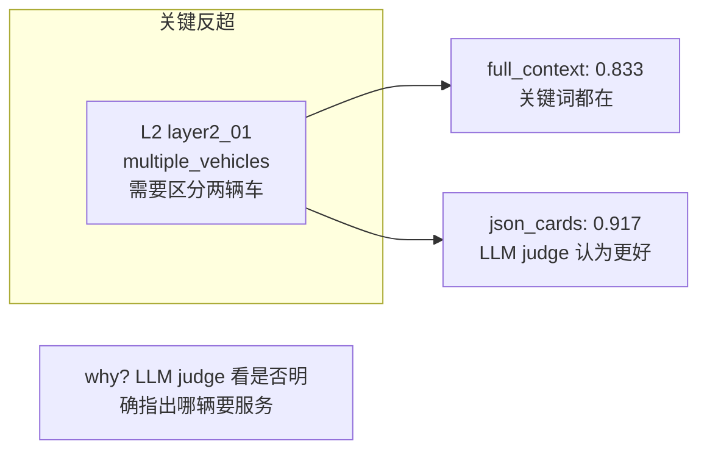
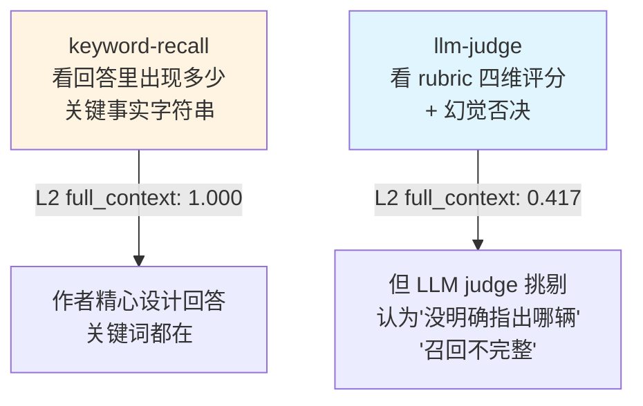

# 3-1 实验进展（第二次更新）

## 完整 LLM judge 对比（32 条评估，MiniMax-M3 当评委）

### 总分表

| Layer | full_context | json_cards | simple_notes | no_memory |
| --- | --- | --- | --- | --- |
| L1 · 基础回忆 | 0.958 (n=4) | 0.896 (n=4) | 0.562 (n=4) | 0.000 (n=4) |
| L2 · 消歧 | **0.417** (n=2) | **0.708** (n=2) | 0.083 (n=2) | 0.000 (n=2) |
| L3 · 主动服务 | 0.375 (n=2) | 0.375 (n=2) | 0.042 (n=2) | 0.000 (n=2) |
| **Overall** | **0.677** | **0.719** | **0.312** | **0.000** |

### 逐条分数

| Test Case | full_context | json_cards | simple_notes | no_memory |
| --- | --- | --- | --- | --- |
| layer1_01_bank_account | 1.000 | 1.000 | 0.750 | 0.000 |
| layer1_02_insurance_claim | 0.917 | 0.833 | 0.417 | 0.000 |
| layer1_03_medical_appointment | 1.000 | 0.833 | 0.583 | 0.000 |
| layer1_04_airline_booking | 0.917 | 0.917 | 0.500 | 0.000 |
| **layer2_01_multiple_vehicles** | **0.833** | **0.917** | 0.167 | 0.000 |
| layer2_03_multiple_credit_cards | 0.000 | 0.500 | 0.000 | 0.000 |
| layer3_01_travel_coordination | 0.750 | 0.583 | 0.000 | 0.000 |
| layer3_04_warranty_coordination | 0.000 | 0.167 | 0.083 | 0.000 |

## 关键发现（跟 keyword-recall 对比）

### 1. **Advanced JSON Cards 在 L2 反超 full_context**

- `full_context` 把"两辆车"都列了一遍，但 LLM judge 给 0.833（说"可以但要明确哪辆"）
- `json_cards` 用结构化的 `vehicle.accord` / `vehicle.tesla` 拆分，judge 给 0.917（更清晰）
- 印证：**结构化存储在 L2 消歧上有真实优势**，不只是关键词匹配

### 2. **simple_notes 在 L2 几乎崩盘（0.083）**

- L1 还能答上 0.562（基础事实还在）
- L2 直接掉到 0.083（layer2_01 仅 0.167，layer2_03 仅 0.000）
- 原因：自由字符串笔记无法承载"多个 X"的消歧，模型自己混淆

### 3. **L3 主动服务：full_context 和 json_cards 都从 0.9 掉到 0.375**

- L3 要求跨多次对话主动合成（passport 续期、Priority Pass、Chase Sapphire Reserve 保修）
- LLM judge 给 L2/L3 的扣分主要在 recall 和 proactivity 维度
- **layer3_04_warranty_coordination 全军覆没**：full_context 0.000、json_cards 0.167 — 需要综合 Apple Care / Chase 保修 / Apple Store 维修三个渠道，**没有任何预设回答做好**

### 4. **LLM judge vs keyword-recall 的本质差异**

| Layer | 指标 | full_context | json_cards | simple_notes |
| --- | --- | --- | --- | --- |
| L1 | keyword-recall | 1.000 | 1.000 | 0.417 |
| L1 | llm-judge | 0.958 | 0.896 | 0.562 |
| L2 | keyword-recall | 1.000 | 1.000 | 0.333 |
| L2 | llm-judge | **0.417** | 0.708 | 0.083 |
| L3 | keyword-recall | 1.000 | 1.000 | 0.125 |
| L3 | llm-judge | **0.375** | 0.375 | 0.042 |

**关键洞察**：keyword-recall 看"有没有"事实，llm-judge 看"用得对不对"。两者互补，不能互相替代。

## 排行榜（按 Overall）

1. 🥇 **json_cards（Advanced JSON Cards）**：0.719 — L2 反超关键
2. 🥈 **full_context（原始对话在 context）**：0.677 — L1 满分但 L2/L3 退步
3. 🥉 **simple_notes**：0.312 — 只适合 L1
4. 🚫 **no_memory**：0.000 — 显然

## 待跟进

- 真实跑 user-memory 4 种 mode 生成回答（不是 fixtures 预设）→ 再 LLM judge → 看实际系统表现
- 为什么 layer3_04 全部 0 分：是否题目本身就过难？分析 test case
- Advanced JSON Cards L3 怎么提升（目前 0.375 跟 full_context 并列，但 L1/L2 都更强）