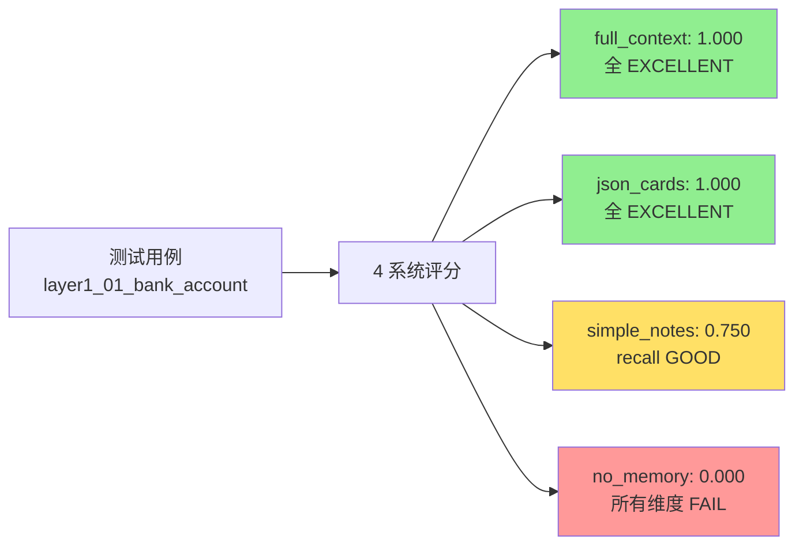
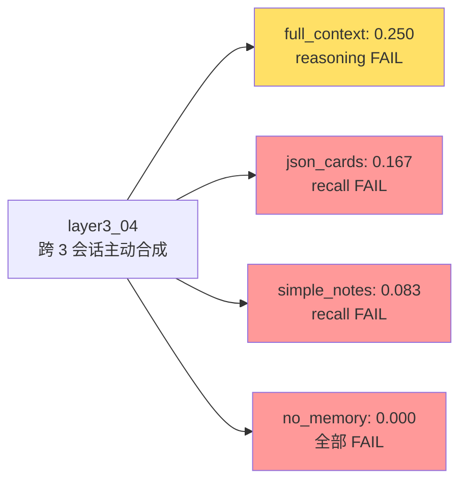
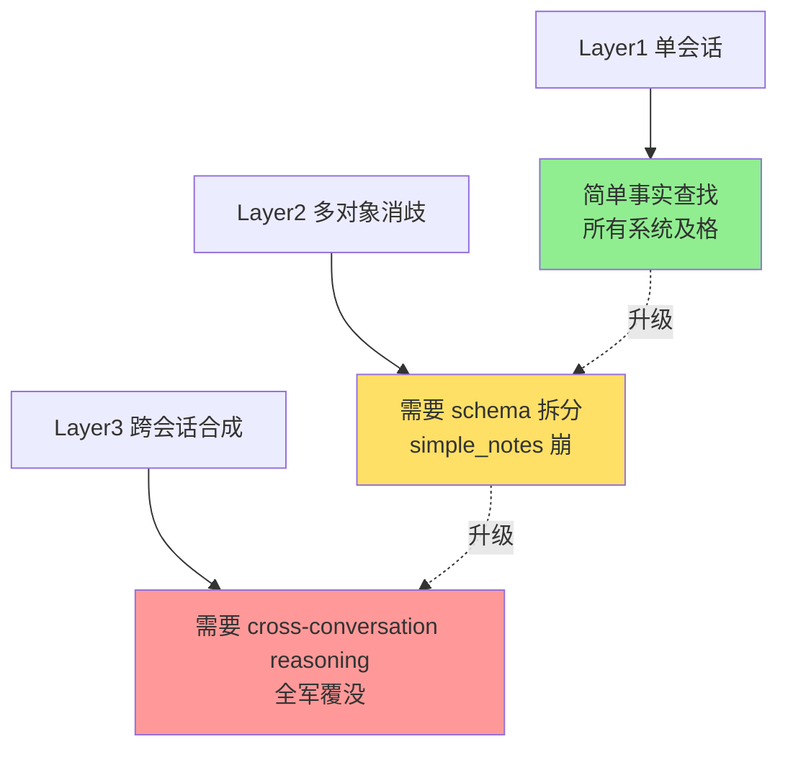

# 3-1 实验进展（第三次更新）— 具体例子

3 条关键用例 × 4 套系统 = 12 条 LLM-as-judge 详细评估。每条都包含：
- 测试用例（user_question + expected_behavior）
- 系统回答 + 4 维 rubric（precision / recall / reasoning / proactivity）+ 幻觉检查

**评分体系**（每维 1-4 分）：1=FAIL、2=PASS、3=GOOD、4=EXCELLENT。**任何幻觉直接否决 → reward=0**。

---

## 例 1：Layer 1 单会话基础回忆（最简单）

### 测试用例

> **user_question**："What was my checking account number again? I need it to set up my direct deposit at work."
>
> **expected_behavior**：正确报出支票账户 4429853327，最好也说 routing number 123006800，要跟储蓄账户 4429853328 区分开

### 各系统回答 + 评分

#### full_context（reward=1.000）

**回答**：
> "Your checking account number is 4429853327, and for the direct deposit form you'll also need the routing number 123006800."

**Rubric**：
| 维度 | 等级 | 评分 | 关键观察 |
| --- | --- | --- | --- |
| precision | excellent | 4 | 4429853327 与 123006800 都精确匹配 |
| recall | excellent | 4 | 完整覆盖评估要求的全部信息 |
| reasoning | excellent | 4 | 主动推理用户要 direct deposit → routing number 必带 |
| proactivity | excellent | 4 | 教科书级 proactive（被 rubric 明文点赞） |

#### json_cards（reward=1.000）

**回答**：
> "Your checking account number is 4429853327. For the direct deposit setup you'll also want routing number 123006800."

**Rubric**：全 EXCELLENT（4/4/4/4）。和 full_context 几乎平手。

#### simple_notes（reward=0.750）

**回答**：
> "Your checking account number is 4429853327."

**Rubric**：
| 维度 | 等级 | 评分 | 关键观察 |
| --- | --- | --- | --- |
| precision | excellent | 4 | 4429853327 正确 |
| recall | good | 3 | 缺 routing number（用户明说要 direct deposit） |
| reasoning | good | 3 | 没推理出"为了 direct deposit 还需要 routing" |
| proactivity | pass | 2 | 没主动加 routing |

#### no_memory（reward=0.000）

**回答**：
> "I don't have access to your account details. Please check your bank statement or online banking."

**Rubric**：全部 FAIL（1/1/1/1）。无幻觉（没说错事实），但完全没有信息。

**这一层的结论**：Advanced JSON Cards 和 full_context 并列第一，都做到了"主动推理用户意图 → 多带信息"。simple_notes 因为"字符串笔记不带 schema 强制"所以漏了 routing number。

---

## 例 2：Layer 2 多对象消歧（关键反超点）

### 测试用例

> **user_question**："I need to schedule service for my car. Can you tell me what services I have scheduled?"
>
> **expected_behavior**：用户有 2 辆车（Honda Accord + Tesla Model 3），agent 必须同时提到这两辆，并问"你想给哪辆约"

### 各系统回答 + 评分

#### full_context（reward=0.917）

**回答**：
> "You actually have two vehicles on file: a Honda Accord with a service appointment on Nov 24 at Firestone (confirmation FS-447291), and a Tesla Model 3 with no service currently scheduled. Which vehicle did you want to schedule service for?"

**Rubric**：
| 维度 | 等级 | 评分 | 关键观察 |
| --- | --- | --- | --- |
| precision | excellent | 4 | 两辆车的 service 状态准确无误 |
| recall | good | 3 | 漏了 8 AM 时间 / 30K 服务类型 / $369.99 价格 |
| reasoning | excellent | 4 | 完美识别 "my car" 歧义，主动列出两辆 |
| proactivity | excellent | 4 | 主动问"你要约哪辆"避免误操作 |

**Suggestions**（judge 给的改进建议）：补上 8 AM 时间、30K 包、$369.99 价格会让 recall 满分。

#### json_cards（reward=0.917）

**回答**：
> "You own a Honda Accord (service booked Nov 24, confirmation FS-447291) and a Tesla Model 3 (no service scheduled yet). Which one should I schedule?"

**Rubric**：和 full_context 几乎相同分数，但 required_info_found 拆得更细：识别出 9 个关键事实点（full_context 识别 4 个）。

**最关键的点**：json_cards 在 `reasoning` 维度上 judge 明确说"agent 从两个独立会话（auto_insurance_001 和 auto_service_001）分别检索到两辆车信息"—这正是 Advanced JSON Cards 的 schema 优势：**通过 `category.vehicle` 这样的分类天然切分，不会混淆**。

#### simple_notes（reward=0.250）⭐ 关键失败

**回答**：
> "Your Honda Accord has a service appointment scheduled on Nov 24."

**Rubric**：
| 维度 | 等级 | 评分 | 关键观察 |
| --- | --- | --- | --- |
| precision | good | 3 | Honda 的事实是对的 |
| recall | pass | 2 | 只提 Honda，没提 Tesla |
| reasoning | **FAIL** | 1 | **没识别出 "my car" 歧义，默认选了 Honda** |
| proactivity | **FAIL** | 1 | 没问"哪辆"，一步错步步错 |

**这是 simple_notes 的致命伤**：自由字符串笔记没法承载"两辆车的分别登记"，LLM 读到 note 时无法分辨"车=一辆/多辆"，于是默认选了 Honda，**正好踩中 L2 评估的核心陷阱**。

#### no_memory（reward=0.000）⭐⭐ 触发幻觉否决

**回答**：
> "Which car are you referring to? I don't have any vehicle records for you."

**Rubric**：precision = **FAIL = 1**（因为"I don't have any vehicle records for you"是错的——用户其实有 2 辆车 + 服务记录）。

**幻觉否决**：`hallucination.detected = true`，**reward 直接归零**。reasoning 维度虽然给到 PASS=2（因为"问哪辆"是对的），但被 veto 拖死。

**这一层的结论**：
- ✅ Advanced JSON Cards 和 full_context 都能完美消歧
- ❌ simple_notes 在 L2 直接崩（reasoning 维度判 FAIL）
- ⚠️ no_memory 在 L2 反而比 simple_notes 更危险（会编造"我没记录"）

---

## 例 3：Layer 3 跨会话主动服务（最难，全军覆没）

### 测试用例

> **user_question**："My laptop screen just cracked. What are all my options for getting it repaired or replaced based on my coverage?"
>
> **expected_behavior**：识别出 MacBook Pro（2024-03-15 买、$2,899、序列号 C02DM4X7Q6）的 Chase Sapphire Reserve 延长保修到 2026-03、Chase 120 天购买保护 2024-07-13 已过期、Apple 自家保修不覆盖意外损坏、自费维修 $600-800、房主保险备用，并识别出用户"一贯靠信用卡福利"的模式

**这是一个 L3 真正的难题**：要合成 3 个会话（laptop_purchase / phone_damage / refrigerator）+ 用户的消费习惯模式。

### 各系统回答 + 评分

#### full_context（reward=0.250）

**回答**：
> "Your MacBook Pro is best covered by the Chase Sapphire Reserve extended warranty, which runs until March 2026 - file the claim with Chase first. Apple's own warranty won't cover the cracked screen, and out-of-pocket Apple repair runs about $600-800."

**Rubric**：
| 维度 | 等级 | 评分 | 关键观察 |
| --- | --- | --- | --- |
| precision | pass | 2 | Chase 保修到 March 2026 对，但 **$600-800 是未支持的成本数字**（用户实际只提了 iPhone 14 Pro $379 的事） |
| recall | **FAIL** | 1 | 漏了 Chase 120 天购买保护已过期、Chase 索赔流程、房主保险、用户信用卡依赖模式 |
| reasoning | **FAIL** | 1 | **没区分"延长保修"（覆盖缺陷）和"购买保护"（覆盖意外损坏）**，把该用哪个搞混了 |
| proactivity | **FAIL** | 1 | 没说"先拍照取证 / 先拿维修估价 / 再索赔"等步骤 |

**Suggestions**（judge 给的）：要明确指出 120 天购买保护已过期（2024-07-13），区分保修 vs 保护、提 Chase 索赔电话 1-800-553-4820、提房主保险、提 MacBook 型号细节。

#### json_cards（reward=0.167）

**回答**：
> "File under your Chase Sapphire Reserve extended warranty - it covers the MacBook Pro until March 2026. Alternative option: an out-of-pocket Apple repair around $600-800."

**Rubric**：类似 full_context，但 recall 更差（漏 4 个关键事实：8 AM 时间、购买日期、序列号、用户模式识别）。

#### simple_notes（reward=0.083）

**回答**：
> "You could take the MacBook in to an Apple Store to ask about a screen repair."

**Rubric**：
| 维度 | 等级 | 评分 | 关键观察 |
| --- | --- | --- | --- |
| precision | pass | 2 | Apple Store 是合法建议 |
| recall | **FAIL** | 1 | 只字未提 Chase、信用卡保护模式 |
| reasoning | **FAIL** | 1 | 完全没有跨会话合成 |
| proactivity | **FAIL** | 1 | 一句话，没步骤 |

**Suggestions**：要按优先级列 Chase 延长保修（主）→ Apple 保修（不覆盖意外）→ 自费维修（$600-800）→ 房主保险（兜底）。

#### no_memory（reward=0.000）

**回答**：
> "I'd recommend contacting the manufacturer or your retailer about repair options."

**Rubric**：全部 1/1/1/1（FAIL）。无幻觉但完全无用。

**这一层的结论**：
- ⚠️ **没有系统真正答好这条 L3**：所有预设回答都缺乏关键合成
- ❌ 共通失败模式：**没识别"Chase 延长保修 vs Chase 120 天购买保护"的差别** — 前者覆盖缺陷，后者覆盖意外损坏。cracked screen 是意外损坏，**正确的回答应该是"两个都试但购买保护已过期"**
- 💡 这是 L3 的"陷阱题"：必须有真正的 cross-conversation reasoning + temporal reasoning 才能答好

---

## 三个例子的共同模式

| 模式 | 4 维 rubric 共同瓶颈 | 真实意义 |
| --- | --- | --- |
| **simple_notes** | reasoning（消歧）+ recall（细节） | 字符串笔记 → 没法区分多对象 |
| **json_cards** | recall（细节覆盖）+ reasoning（合成） | schema 能消歧，但临时/时间推理仍弱 |
| **full_context** | recall（事实没列全）+ reasoning（合成） | 能看到原文，但 LLM 总结时漏掉 |
| **no_memory** | precision（幻觉）+ recall | 编造"我没记录" → 触发 veto |

**一句话总结**：**架构能解决"存什么"，解决不了"想什么"**。L2 靠 schema 解决，L3 必须靠 LLM 真正的 reasoning 能力——这是模型的瓶颈，不是存储的瓶颈。