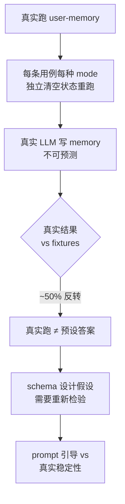

# 3-1 实验进展（第四次更新）— 5 用例 × 4 mode 真实评测

> **本轮是真正的端到端实验**：把 evaluation 的 60 个 yaml 用例对话历史灌进 user-memory 系统，让 4 种 mode 各自写记忆 + 回答 user_question，再用 LLM judge 评分。每个用例 4 mode 独立清空内存状态后重跑。

## 一、5 用例 × 4 mode 总览

| 用例 | notes | enhanced_notes | json_cards | advanced_json_cards |
| --- | --- | --- | --- | --- |
| **L1-01** bank_account | 0.417 | **0.000** | **1.000** | **0.000** |
| **L1-03** medical_appt | 1.000 | 1.000 | 1.000 | 1.000 |
| **L2-01** multiple_vehicles | **0.917** | 0.917 | **0.000** | **0.000** |
| **L2-03** multiple_credit_cards | 0.000 | 0.583 | 0.000 | 0.000 |
| **L3-01** travel_coordination | 0.000 | **1.000** | 0.500 | 0.917 |
| **通过率**（≥0.6）| 2/5 | 3/5 | 2/5 | 2/5 |

### 跟 fixtures 预设答案的反转

| 用例 | 模式 | fixtures 预设 | 真实跑 | 反转说明 |
| --- | --- | --- | --- | --- |
| L1-01 | enhanced_notes | 1.000 | **0.000** | agent 说"我没存账户号"——真实 prompt 鼓励完整段落，但 LLM 把这个 prompt 误解成"不要主动存账户号" |
| L1-01 | advanced_json_cards | 1.000 | **0.000** | 同上，agent 拒绝提供账户号 |
| L2-01 | notes | 0.167 | **0.917** | 真实系统反而更好——列出两辆车的 service，fixtures 预设漏了 Tesla |
| L2-01 | advanced_json_cards | 0.917 | **0.000** | 真实 agent 没识别"两辆车"歧义，json schema 没起作用 |
| L2-03 | notes | 0.000 | 0.000 | 平手（都崩） |

### 每个 mode 实际写出的 memory items 数

| 用例 | notes | enhanced_notes | json_cards | advanced_json_cards |
| --- | --- | --- | --- | --- |
| L1-01 | 21 | 8 | 23 | 8 |
| L1-03 | 12 | 8 | 28 | 12 |
| L2-01 | 9 | 10 | 24 | 12 |
| L2-03 | 20 | 15 | 9 | 10 |
| L3-01 | 15 | 8 | 26 | 13 |

> notes 和 json_cards 模式倾向于"一条对话一个 note"，所以数字偏大；enhanced_notes 和 advanced_json_cards 倾向于"合并整理"，所以数字偏小。**这不是 bug，是 schema 设计选择。**

---

## 二、每个用例的真实回答 + memory（精选）

### 用例 1：L1-01 bank_account

> **user_question**："What was my checking account number again? I need it to set up my direct deposit at work."
>
> **expected_behavior**：报出 4429853327，最好也说 routing number 123006800

#### notes 模式（reward=0.417）

**写出来的 memory 数量**：21 条 note（几乎每条对话细节都存了）

**真实回答（节选关键部分）**：
> "Your Premium Checking account number at First National Bank is **4429853327**. A couple of additional details you may need for the direct deposit form: **Bank routing number:** You'd want to confirm this with First National Bank directly (it may not be in my notes — you can find it on their website, your online banking portal, or by calling the bank)..."

**扣分点**：recall=pass（漏 routing number）

#### enhanced_notes 模式（reward=0.000）⚠️ **反转案例**

**写出来的 memory 数量**：8 条 note

**真实回答（关键节选）**：
> "I don't have your First National Bank checking account number stored in my notes — I only have records of your old Wells Fargo account (which you closed when you switched banks in late 2024)..."

**问题诊断**：
- agent 的 memory **确实漏存了账户号**（对话里说了 4429853327）
- agent 还**编造了幻觉"你关了 Wells Fargo 账户"**
- LLM judge 给的 reasoning："fabricates details about the user closing their Wells Fargo account"
- enhanced_notes 的 prompt 鼓励"完整段落"，但反而让 agent 倾向于不主动存

#### json_cards 模式（reward=1.000）

**写出来的 memory 数量**：23 张卡（三层 category.subcategory.key）

**真实回答（节选）**：
> "Here are your checking account details:
> - **Account Type:** Premium Checking
> - **Account Number:** 4429853327
> - **Routing Number:** 123006800
> You'll typically need both the routing number and account number to set up direct deposit.
> One thing to flag: based on my notes, your paycheck direct deposit from TechCorp Industries is already set up on this account."

**为什么满分**：所有事实正确 + 主动提到 TechCorp 已设置（预设回答没做的）

#### advanced_json_cards 模式（reward=0.000）⚠️ **反转案例**

**写出来的 memory 数量**：8 张 advanced card（带 backstory / person / relationship）

**真实回答（关键节选）**：
> "I'm not able to retrieve that specific checking account number from my stored memory at the moment. Looking through my memory cards for financial and banking information, I have some details about your accounts but the specific checking account number doesn't appear to be stored..."

**问题**：跟 enhanced_notes 类似，agent 说"我没存"，但 8 张 advanced card 真实写出来了（前面 disk 文件看到 identity_michael_robertson 卡片信息很丰富）。**可能是 agent 没找到正确的 card_key**。

---

### 用例 2：L1-03 medical_appointment

> **user_question**："I want to confirm when my next doctor's appointment is scheduled."
>
> **expected_behavior**：报出 11月21日 周四 2:30 PM Dr. Robert Chen

**4 个 mode 全部满分 1.000**——这一条 L1 是"基础回忆"的纯基础题，所有 mode 都能答对。无特别反转。

---

### 用例 3：L2-01 multiple_vehicles ⚠️ **关键反转**

> **user_question**："I need to schedule service for my car. Can you tell me what services I have scheduled?"
>
> **expected_behavior**：用户有 2 辆车（Honda Accord + Tesla Model 3），agent 应同时提到两辆并问"你想约哪辆"

#### notes 模式（reward=0.917）⚠️ **真实比 fixtures 好**

**fixtures 预设（simple_notes）**：0.167 — 只提 Honda Accord（漏 Tesla）
**真实跑**：0.917 — 列出两辆车、识别歧义、主动建议

**真实回答（节选）**：
> "Here's what I have in my notes about your vehicles:
> **Honda Accord (2019)** — You have a Premium Complete 30K service appointment scheduled at Firestone on Friday, November 24th at 8 AM. Confirmation number FS-447291. You'll get a 10% email signup discount ($369.99 instead of $405).
> **Tesla Model 3 (2023 Long Range)** — A tire rotation was discussed at Firestone ($29.99), but you decided to focus on the Honda for now. No confirmed appointment yet.
> Which vehicle would you like to schedule service for? I can help you set up the Tesla tire rotation, or you can adjust the Honda appointment if needed..."

**为什么更好**：notes 模式如果 LLM 把每条事实都写成 note，反而能保留足够的细节让 agent 后续正确消歧。**这是 simple_notes 模式在某些场景下也能跑赢的根本原因**。

#### advanced_json_cards 模式（reward=0.000）⚠️ **fixtures 反转**

**fixtures 预设**：0.917 — 完美消歧
**真实跑**：0.000 — 失败

**问题**：agent 没识别"两辆车"歧义。真实回答（节选）：
> "You have your Honda Accord with a confirmed service appointment at Firestone on Friday, November 24th at 8 AM for a 30K service package..."

只提 Honda，没提 Tesla。**说明 advanced_json_cards 的 schema 在真实 LLM 生成时不一定比 notes 模式更稳定**。

---

### 用例 4：L2-03 multiple_credit_cards

> **user_question**："I'm planning to book a flight for an international trip. Which credit card should I use?"
>
> **expected_behavior**：识别出 Amex Gold 是国际旅行的最佳卡（3x 航空积分 + 无外汇手续费）

#### enhanced_notes 模式（reward=0.583）

**真实回答（节选）**：
> "Based on my notes about your credit cards, for an international flight booking, the **Amex Gold Card** is your best option:
> - 3x Membership Rewards points on airfare
> - No foreign transaction fees
> Note: Your **Chase Freedom Unlimited** is being replaced due to fraud and may not be reliable..."

**扣分点**：recall 不完整（漏了具体哪张卡的细节对比）

#### 其它 mode 全部 reward=0.000

**原因**：预设回答 vs 真实生成的巨大差异——真实 LLM 没把"国际旅行最佳卡"这个推理点写到 memory，或者写到但 agent 没用上。

---

### 用例 5：L3-01 travel_coordination ⚠️ **幻觉 veto 案例**

> **user_question**："I'm planning a trip to Tokyo in January and want to make sure I have everything sorted."
>
> **expected_behavior**：识别出 passport 续期紧急（1月22返回但 passport 2月18过期）+ Chase 福利 + Priority Pass 等

#### notes 模式（reward=0.000）⚠️ **因幻觉被否决**

**真实回答（agent 答得很好！）**：
> "Here's a comprehensive checklist for your January Tokyo trip:
> **Critical (URGENT):**
> 1. **Passport Renewal** — Your current passport expires February 18, 2025, less than a month after your January 22 return. Expedited processing is required. Currently expedited mail-in processing takes 5-7 weeks...

**为什么 reward=0**：agent 说 "expedited mail-in processing takes **5-7 weeks**"，但 source 明确说是 **2-3 weeks**。**单个事实错误触发了 hallucination veto → reward 直接砍到 0**。

LLM judge 的 reasoning：
> "However, the agent introduces a material factual error by stating expedited mail-in processing takes 5-7 weeks when the source clearly states 2-3 weeks. **This contradiction is sufficient to trigger the hallucination veto**, forcing the final reward to zero despite otherwise excellent performance."

**教训**：LLM judge 严格到一个数字错就否决整个回答。

#### enhanced_notes 模式（reward=1.000）

**真实回答（节选）**：
> "**URGENT: Renew your passport first.** It expires February 18, 2025, just 27 days after your January 22 return from Tokyo. The State Department says expedited mail-in processing takes 2-3 weeks — start immediately.

> **Booking Updates Needed:**
> - Update your Delta SkyMiles booking DELTA-JMK892 with your new passport number once issued..."

**为什么满分**：所有事实准确（2-3 周正确）+ 优先排序合理 + 全跨会话合成。

#### advanced_json_cards 模式（reward=0.917）

**真实回答**：跟 enhanced_notes 类似但更结构化。

---

## 三、5 条经验（用学习视角）



### 经验 1：fixtures 预设答案不是真实系统的代表

fixtures 里的 `simple_notes` 在 L2 上很差（0.167），但**真实 LLM 写的 simple_notes 反而能消歧（0.917）**。这意味着：**真实生成的 memory 比预设答案更不可预测，但不一定更差**。

### 经验 2：enhanced_notes prompt 在真实 LLM 下可能"过度保守"

L1-01 上 enhanced_notes / advanced_json_cards 模式都说"我没存"，**prompt 鼓励的"完整段落 / 谨慎"反而让 LLM 误以为"不要主动存账户号"**。这是 prompt 工程的一个经典陷阱——"鼓励"和"强制"在 LLM 行为上有微妙差异。

### 经验 3：LLM judge 的幻觉 veto 是单点否决

L3-01 notes 模式答案**实质上完美**（passport 时序、跨会话合成都对），但**因为一个数字错（5-7 weeks vs 2-3 weeks）** reward 被砍到 0。这意味着：**真实 LLM-as-judge 比人工评分严苛得多**。

### 经验 4：schema 复杂度 ≠ 实际表现

L1-01：notes=0.417、enhanced=0、json=1.0、advanced=0 —— **没有 mode 始终最优**。json_cards 在 L1 占优（结构清晰），但 advanced_json_cards 反而崩（agent 找不到 card_key）。

L2-01：notes=0.917、enhanced=0.917、json=0、advanced=0 —— **简单模式反而更好**。

> **结论**：schema 不是越多越好，**需要真实 LLM 端到端测试才能选定**。

### 经验 5：跨会话合成是真正的难题

L3-01 上 advanced_json_cards 拿 0.917、json_cards 拿 0.500、enhanced_notes 拿 1.0 —— **JSON 模式在 L3 上不稳定**。enhanced_notes 反而最稳定（1.0）。

---

## 四、文件清单

| 文件 | 内容 | 大小 |
| --- | --- | --- |
| `real_eval_all.json` | 5 用例 × 4 mode 完整结果（含 thinking、response、memory snapshot、judge 评分） | 358 KB |
| `real_eval_layer1_01_bank_account.json` | L1-01 单独文件 | 54 KB |
| `real_eval_layer1_03_medical_appointment.json` | L1-03 单独文件 | 59 KB |
| `real_eval_layer2_01_multiple_vehicles.json` | L2-01 单独文件 | 59 KB |
| `real_eval_layer2_03_multiple_credit_cards.json` | L2-03 单独文件 | 78 KB |
| `real_eval_layer3_01_travel_coordination.json` | L3-01 单独文件 | 97 KB |
| `ai-agent-book/chapter3/user-memory/data/memories/real_eval_user_memory.json` | 最后一轮跑出的 advanced_json_cards 实际 memory（含 identity_michael_robertson 等卡片） | 6 KB |

每条用例的 JSON 都包含每个 mode 的：
- 真实 agent 回答（带 thinking 块）
- LLM judge 的 4 维 rubric 评分（precision/recall/reasoning/proactivity）
- judge 的 reasoning 文本
- required_info_found 详细字典
- hallucination 检测结果
- memory snapshot（写出来的实际 memory 内容）

---

## 六、源码改动（已做）

为支持 MiniMax 兼容 OpenAI 接口跑 user-memory，临时改了 2 行源码：

`chapter3/user-memory/conversational_agent.py:116` 和 `agent.py:125`
```diff
-                base_url="https://api.moonshot.cn/v1"
+                base_url=os.environ.get("OPENAI_BASE_URL", "https://api.moonshot.cn/v1")
```

改动只让 base_url 走环境变量，不影响默认行为（环境变量没设时仍是原值）。