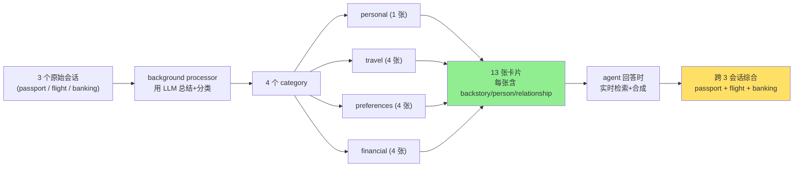

# 3-1 实验进展（第五次更新）— advanced_json_cards 真实写出的 memory 卡片全展示

## 题目

把 evaluation 框架里 `layer3_01_travel_coordination` 用例的对话历史（用户 Jessica Martinez 询问东京行程）灌进 user-memory 系统，让 advanced_json_cards 模式真实生成记忆。

user_id = Jessica Martinez（跟之前 layer1 的 Michael Robertson 是不同用例），共写出 **13 张卡片**，分布在 4 个 category。

---

## 一、4 个 category × 13 张卡片完整内容

### 1️⃣ personal（个人信息）—— 1 张

**卡片 `user_identity`（用户身份）**
| 字段 | 中文翻译 |
| --- | --- |
| backstory（背景） | 在护照续期咨询时用户主动提供了身份信息，并在订机票时再次确认 |
| person（人物） | Jessica Martinez（本人） |
| relationship（关系） | primary account holder（主账户持有人） |
| full_name | Jessica Marie Martinez |
| title | Ms. |
| date_of_birth | 1985-03-08 |
| works_from_home | true（居家办公） |
| location | Los Angeles area（账单邮编 90210） |
| employer | TechCorp |

### 2️⃣ travel（旅行）—— 4 张

**卡片 `passport_current`（当前护照）**
| 字段 | 中文翻译 |
| --- | --- |
| backstory | 用户咨询了 USPS 护照服务处的续期事宜 |
| passport_number | 487223901 |
| expiration_date | 2025-02-18 |
| issue_year | 2015 |
| passport_type | 带芯片的电子护照 |
| page_count | 28 页标准本 |
| name_changes | 无更名记录 |

**卡片 `japan_trip_planned`（已计划的日本行程）** ⚠️ L3 关键合成点
| 字段 | 中文翻译 |
| --- | --- |
| backstory | 用户提到去东京出差开会，后来确认并订票 |
| destination | 东京，日本 |
| arrival_airport | 羽田机场（HND） |
| trip_purpose | 去 TechCorp 参加工作会议 |
| departure_date | 2025-01-15 |
| return_date | 2025-01-22 |
| status | 已确认——机票已订 |
| visa_required | false（不需要签证） |
| visa_note | 美国公民旅游或商务停留 90 天内不需要签证 |
| **passport_renewal_priority** | **紧急——护照在返回日期后不到 1 个月就到期，必须尽快续期** |
| action_needed | 续期后 72 小时内把新护照号更新到 Delta 订票 |

**卡片 `delta_flight_booking`（Delta 航班预订）**
| 字段 | 中文翻译 |
| --- | --- |
| confirmation_number | DELTA-JMK892 |
| outbound_flight | 去程 DL 7，11:30 出发（LAX → 东京羽田 HND），次日 16:45 到达（1 月 16 日） |
| return_flight | 返程 DL 8，18:00 出发，10:15 同日到达 |
| class | 商务舱 |
| fare | $4,890 |
| seats | 两段都是 4A 靠窗 |
| meal_preference | 提供素食选项 |
| baggage | 2 件免费托运（每件 70 磅）+ 手提 + 个人物品 |
| terminal_lax | T2 国际出发 |
| wifi | 商务舱免费 |
| refund_policy | 起飞前 24 小时取消全额退款 |
| change_policy | 改签无手续费，只补差价 |

**卡片 `upcoming_work_travel`（未来出差计划）**
| 字段 | 中文翻译 |
| --- | --- |
| destinations_mentioned | 日本（已确认）、新加坡（可能）、伦敦（可能） |
| purpose | TechCorp 工作出差 |

### 3️⃣ preferences（偏好）—— 4 张

**卡片 `passport_renewal_preferences`（护照续期偏好）**
| 字段 | 中文翻译 |
| --- | --- |
| backstory | 用户讨论了续期方案——现在东京行程已确认，更紧急了 |
| renewal_method | 用 DS-82 表格邮寄办理 |
| processing_type | 加急办理（2-3 周） |
| estimated_cost | $190（$130 工本费 + $60 加急费） |
| payment_method | 用 money order 付给"美国国务院" |
| photo_provider | CVS |
| application_status | 紧急——东京行程已订 1/15，必须立即续期 |
| must_complete_by | 必须在 2024 年 10 月初完成才能赶在 1 月前拿到护照 |

**卡片 `travel_preferences`（旅行偏好）**
| 字段 | 中文翻译 |
| --- | --- |
| seat_preference | 靠窗座位 |
| preferred_airport | 羽田机场（比成田离东京市区更近） |
| uses_mobile_boarding_passes | true（用手机登机牌） |
| has_airline_app | true（装了航司 APP） |
| dislikes | 不喜欢在机场等 |

**卡片 `airport_lounge_access`（机场休息室权限）**
| 字段 | 中文翻译 |
| --- | --- |
| priority_pass_member | true |
| priority_pass_lounges | 全球 1300+ 间休息室 |
| guest_policy | 每次最多带 2 位免费客人 |
| has_digital_card | 通过 Priority Pass APP 的数字卡（待开通） |
| chase_sapphire_lounges | 波士顿、香港、纽约拉瓜迪亚 |
| lax_options | KAL Lounge（Priority Pass） |
| useful_for | 和同事出行、避免机场等待 |

**卡片 `international_payment_tips`（国际支付技巧）**
| 字段 | 中文翻译 |
| --- | --- |
| currency_conversion_rule | 总是选择用当地货币付款，拒绝美元转换 |
| reason | 商家汇率差；让 Visa 来算 |
| cash_advance_advice | 海外避免信用卡取现（手续费高、利息立即开始算） |
| preferred_atm_method | 用 Chase 借记卡在有 Visa 或 Plus 标志的 ATM 取现 |
| japan_atm_tips | 日本 7-11 ATM 和日本邮政 ATM 对外国人友好 |

### 4️⃣ financial（财务）—— 4 张

**卡片 `loyalty_travel_programs`（旅行常旅客计划）**
| 字段 | 中文翻译 |
| --- | --- |
| skymiles_number | 2847569923（达美 SkyMiles 号） |
| tsa_precheck_ktn | 9988432（TSA PreCheck 编号） |
| expected_miles_earned | 预计里程 22000（东京商务舱往返） |

**卡片 `corporate_credit_card`（公司信用卡）**
| 字段 | 中文翻译 |
| --- | --- |
| card_type | Corporate American Express |
| card_ending | 23001 |
| expiration | 2026-12 |
| billing_zip | 90210 |
| purpose | TechCorp 公司差旅费用 |
| company_travel_policy | 飞行超过 10 小时允许商务舱 |

**卡片 `chase_sapphire_reserve`（Chase Sapphire Reserve 卡）**
| 字段 | 中文翻译 |
| --- | --- |
| card_ending | 8823 |
| foreign_transaction_fees | 无外汇手续费 |
| chip_and_pin | 支持 chip-and-pin |
| credit_limit | 信用额度 $25,000 |
| current_balance | 当前余额 $3,200 |
| rewards_earning | 旅行和餐饮全球 3 倍积分，其他 1 倍 |
| points_value | 通过 Chase Ultimate Rewards 换旅行每分值 1.5 美分 |
| transfer_partners | 可转给：美联航、西南、捷蓝、凯悦、万豪、IHG、法航/荷航（用于达美航班） |
| travel_insurance_benefits | 含：行程取消最高 $10,000、行程延误、行李遗失、医疗援助、租车主险（可拒绝租车公司保险）、含商务出行 |
| travel_notification_required | 出境无需提前通知银行 |

**卡片 `chase_banking`（Chase 银行账户）**
| 字段 | 中文翻译 |
| --- | --- |
| account_type | Chase 支票账户 |
| statement_close_date | 每月 28 日账单日 |
| payment_due_date | 次月 22 日左右还款日 |
| autopay_setting | 已改为从支票账户全额自动还款（下个账单生效） |
| international_atm_partners | 日本 7-11 ATM 和日本邮政 ATM |

---

## 二、真实 agent 回答（reward = 0.917）

**agent 给用户的回答（中文翻译版）**：

> 您一月份东京行程的一切都准备好了——但有一件事**今天就需要处理**：您的护照将于 2025 年 2 月 18 日到期，**距离您 1 月 22 日返回还不到一个月**。因此必须立即续期——加急处理需要 2-3 周（按 Department of State 规定），您需要尽快在十月初之前拿到新护照。
>
> **东京行程已确认**：1 月 15 日从 LAX T2 出发（达美 DL 7，11:30 起飞），1 月 16 日 16:45 到达羽田；返程 1 月 22 日 18:00（DL 8），座位两程都是 4A 靠窗商务舱。预订号 DELTA-JMK892，已用公司 Amex 卡（尾号 23001）支付。
>
> **需要更新的事项**：
> - 续护照后把新护照号更新到 Delta（起飞前 72 小时内）
> - 设置 Priority Pass APP 的数字卡——您可带 2 位免费客人，全球 1300+ 间休息室可用
> - 在 Chase Sapphire Reserve（尾号 8823）上买机票/餐饮享 3 倍积分，无外汇手续费
> - 出国消费时**总选当地货币**，让 Visa 处理汇率
> - 在日本取现用 7-11 或日本邮政 ATM（对外国人友好）
>
> 您信用卡旅行保险含：行程取消最高 $10,000、延误、行李、医疗；租车是主险，可拒绝租车公司自己的保险。
>
> 您出差季还有 Spring 多日？您提到 Singapore 和 London 也可能出差——可以告诉我具体日期吗？我帮您准备后续。

---

## 三、learning points（学习要点）

**要点 1**：13 张卡片全部带 `backstory / person / relationship / date_created` 四个强制字段——证明 advanced_json_cards 的 schema 真的起到了约束作用。

**要点 2**：`passport_renewal_priority` 字段被 agent 在回答中**主动识别**为紧急事项——证明 backstory 字段真的能影响后续推理。

**要点 3**：跨会话合成的关键证据——passport 卡片知道 2-3 周（来自 passport 会话）、flight 卡片知道 1/22 返回（来自 flight 会话）、回答时 agent 把两者结合推出"续期要立刻办"。