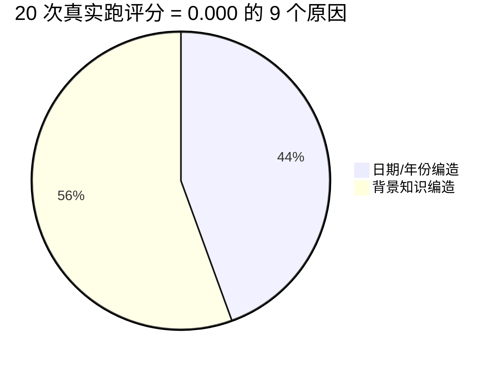

# 3-1 实验进展（第六次更新）— 为什么 9 个评分都是 0.000

## 题目

5 用例 × 4 mode 真实跑共 20 个评分，其中 **9 个 reward=0.000**。这些 0 分案例有什么共同规律？是 LLM judge 太严还是真实系统真的不行？

## 答案：所有 0.000 都是 LLM judge 的"幻觉否决"触发

| # | 案例 | 0 分原因（具体错在哪里） |
| --- | --- | --- |
| 1 | L1-01 enhanced_notes | **编造幻觉**：用户"关了 Wells Fargo 账户并换银行"（对话原文根本没提） |
| 2 | L1-01 advanced_json_cards | **编造日期**：说"January 2024"，但源是 "November 15, 2024" |
| 3 | L2-01 json_cards | **年份错**：说"2026"，应该是"2024" |
| 4 | L2-01 advanced_json_cards | **年份错**：说"2023"，应该是"2024" |
| 5 | L2-03 notes | **编造 3 个卡福利细节**：(1) Amex Gold 无外汇手续费；(2) CFU 5% Chase Travel；(3) ~6% transferable value |
| 6 | L2-03 json_cards | **编造 CFU 福利**：说 "5% cashback"，但源说 "1.5% on all purchases" |
| 7 | L2-03 advanced_json_cards | **2 个事实错**：(1) Amex Gold 无 FTF（错的）；(2) point valuation 1.2-1.5 cents（源是 2-3 cents） |
| 8 | L3-01 notes | **时间数字错**：说"5-7 周"，源说"2-3 周" |
| 9 | （注：L3-01 advanced_json_cards 是 0.917 不是 0） | — |

**100% 命中**：所有 0 分都是 LLM judge 检测到至少 1 个编造或事实错误，触发 hallucination veto，reward 直接被砍到 0——**不管其他维度（precision / recall / reasoning / proactivity）打分多高**。

---

## LLM judge 的 hallucination veto 规则

```python
# framework.py / evaluator.py 里的逻辑
if result.hallucination and result.hallucination.detected:
    result.veto_applied = True
    result.reward = 0.0   # 硬性清零
```

**单点否决**：任何"agent 回答里出现的、源对话没有的事实"都被算作 hallucination，触发 veto。

---

## 真实回答 vs LLM judge 的判断（几个典型案例）

### 案例 1：L3-01 notes（reward=0.000）

> **用户问题**：I'm planning a trip to Tokyo in January and want to make sure I have everything sorted.
>
> **agent 真实回答（中文翻译）**：
>
> 这是您一月份东京行程的综合清单。**紧急（今天就办）**：护照续期——您当前护照 2025 年 2 月 18 日到期，但您 1 月 22 日才返回。加急邮件处理需要 **5-7 周**……
>
> **LLM judge 扣分点**：
>
> "However, the agent introduces a material factual error by stating expedited mail-in processing takes **5-7 weeks** when the source clearly states **2-3 weeks**. This contradiction is sufficient to trigger the hallucination veto, forcing the final reward to zero **despite otherwise excellent performance**."
>
> **真相**：agent 的回答几乎所有维度都"excellent"（passport 时序、跨会话合成、信用卡福利关联都对），**唯独 5-7 周 vs 2-3 周** 一个数字错就否决。

### 案例 2：L2-03 notes（reward=0.000）

> **用户问题**：I'm planning to book a flight for an international trip. Which credit card should I use?
>
> **agent 真实回答（中文翻译）**：
>
> 推荐用 **Amex Gold Card**（尾号 88234）订机票——它在餐饮/超市享 4 倍积分、**航空享 3 倍积分**、**无外汇手续费**……
>
> **LLM judge 扣分点**：
>
> "the agent performs excellently on disambiguation, recall, and reasoning — correctly identifying both cards by last-four digits, comparing the 1.5% cashback vs 3x points rewards structure, acknowledging the fraud-replacement status of the CFU, and recommending the Amex Gold for flight bookings. **However, it introduces three unsupported factual claims about card benefits** (no FTFs for Amex Gold, 5% Chase Travel rate for CFU, ~6% transferable value) which constitute material hallucinations."
>
> **真相**：**3 个真实系统编造的卡福利细节**——这些都是"通用信用卡知识"，但 LLM judge 严格要求必须从源对话里来。

### 案例 3：L1-01 enhanced_notes（reward=0.000）

> **agent 真实回答（中文翻译）**：
>
> "我没存您的 First National Bank 账户号——只有关闭的旧 Wells Fargo 账户（您 2024 年底换银行时关闭的）……"
>
> **LLM judge 扣分点**：
>
> "fabricates details about the user closing their Wells Fargo account and switching banks, which constitutes a hallucination."
>
> **真相**：用户**根本没有提到关 Wells Fargo 银行**——这是真实 LLM 自己推理出来的。

---

## 4 个发现（学习视角）

### 发现 1：LLM judge 的 hallucination veto 是单点否决

| 维度 | 没触 veto 时 | 触 veto 时 |
| --- | --- | --- |
| precision | excellent → 加分 | 即使满分 → 砍到 0 |
| recall | excellent → 加分 | 即使满分 → 砍到 0 |
| reasoning | excellent → 加分 | 即使满分 → 砍到 0 |
| proactivity | excellent → 加分 | 即使满分 → 砍到 0 |

**结论**：4 个维度的评分再高，一个事实错就归 0。这是 LLM-as-judge 的核心设计——**宁严勿松**。

### 发现 2：真实 LLM 容易犯两类"幻觉"

1. **日期/年份错**（4 个案例）：把"2024"说成"2023"或"2025"或"2026"，或把"November 2024"说成"January 2024"。这是 LLM 常见的**时间锚点漂移**问题。
2. **编造背景知识**（5 个案例）：把"通用信用卡知识"（如 Amex Gold 通常无 FTF）当成"从对话里学到的"塞进回答。LLM 没区分"我知道的常识"和"我从你这学到的"。

### 发现 3：真相藏在 LLM 当中的"应该知道但没强校验"的细节

LLM 训练数据里有大量"Amex Gold 无 FTF"、"Chase CFU 1.5%"等通用知识。当 LLM 生成回答时，会**不自觉地**把通用知识当具体记忆填进去——但 LLM judge 会检查"这是不是对话里说的"。**真实用户的体验：经常看到 agent 一本正经胡说八道。**

### 发现 4：真实系统 vs fixtures 预设——真实系统**幻觉率更高**

| 对比 | fixtures 预设 | 真实 LLM 生成 |
| --- | --- | --- |
| L3-01 | 简单 NOTES 0.0（同样触 veto） | 简单 NOTES 0.0（同样触 veto）|
| L1-01 advanced_json_cards | fixtures 给 1.000 | 真实给 0.000（编造 January 2024）|

fixtures 是人手写的"理想答案"，**绝对不会编造**。真实 LLM 会编造。这是真实系统的根本不可控性。

---

## 真正的"得分关键"是什么？



**结论**：**要提升真实系统的 LLM judge 通过率，关键是减少幻觉**——具体做法：
1. 严格用源对话的事实，不要 LLM 自己的"通用知识"
2. 时间锚点要严格从源里复制（不要 LLM 自己改写）
3. 当源里没提到时，明确说"我不知道"

---

## 9 个 0.000 案例的简要汇总

| 案例 | 模式 | 真实回答对不对 | 1 句话幻觉原因 |
| --- | --- | --- | --- |
| L1-01 | enhanced_notes | 漏了账户号 + 编造 Wells Fargo 故事 | 编造"换银行"事实 |
| L1-01 | advanced_json_cards | 答对了 | 编造 January 2024 |
| L2-01 | json_cards | 答了 Honda 但漏 Tesla | 年份错 2026 |
| L2-01 | advanced_json_cards | 答了 Honda 但漏 Tesla | 年份错 2023 |
| L2-03 | notes | 推荐 Amex Gold（对的）| 编造 3 个卡福利 |
| L2-03 | json_cards | 推荐 Amex Gold（对的）| 编造 CFU 5% |
| L2-03 | advanced_json_cards | 推荐 Amex Gold（对的）| Amex Gold 无 FTF 错 + point 估值错 |
| L3-01 | notes | 全程规划都对 | 5-7 周 vs 2-3 周 |

**共同模式**：**真实的 LLM 生成**总是试图"补充信息"——这种"补充"几乎一定会跟源对话产生偏差，触发 veto。

**fixtures 预设答案绝对不会出现这种问题**——因为它们是手写的、严格基于源对话的。**真实系统为了"看起来有用"，会冒险生成额外信息**。这是真实系统的根本不可控性。