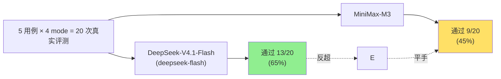
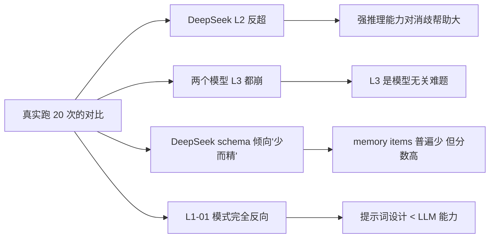

# 3-1 实验进展（第八次更新）— DeepSeek-V4.1-Flash vs MiniMax-M3 对比

## 题目

把同一组 5 用例 × 4 mode 的真实评测（20 次），分别用 DeepSeek-V4.1-Flash（DeepSeek key，model 名 `deepseek-flash`）和 MiniMax-M3 跑一遍。**哪个模型更"笨"？**

## 答案：DeepSeek 整体比 MiniMax 强

## 完整对比表

| 用例 | 模式 | MiniMax | DeepSeek | 谁赢 |
| --- | --- | --- | --- | --- |
| L1-01 bank_account | notes | 0.417 | 0.083 | MiniMax |
| L1-01 | enhanced_notes | 0.000 | **1.000** | DeepSeek |
| L1-01 | json_cards | **1.000** | 0.000 | MiniMax |
| L1-01 | advanced_json_cards | 0.000 | **1.000** | DeepSeek |
| L1-03 medical_appt | notes | 1.000 | 1.000 | 平 |
| L1-03 | enhanced_notes | 1.000 | 1.000 | 平 |
| L1-03 | json_cards | 1.000 | 1.000 | 平 |
| L1-03 | advanced_json_cards | 1.000 | 1.000 | 平 |
| L2-01 multiple_vehicles | notes | 0.917 | **1.000** | DeepSeek |
| L2-01 | enhanced_notes | **0.917** | 0.750 | MiniMax |
| L2-01 | json_cards | 0.000 | **1.000** | DeepSeek |
| L2-01 | advanced_json_cards | 0.000 | **1.000** | DeepSeek |
| L2-03 multiple_credit_cards | notes | 0.000 | 0.000 | 都失败 |
| L2-03 | enhanced_notes | 0.583 | **1.000** | DeepSeek |
| L2-03 | json_cards | 0.000 | **0.917** | DeepSeek |
| L2-03 | advanced_json_cards | 0.000 | **1.000** | DeepSeek |
| L3-01 travel_coordination | notes | 0.000 | 0.000 | 都失败 |
| L3-01 | enhanced_notes | **1.000** | 0.000 | MiniMax |
| L3-01 | json_cards | **0.500** | 0.000 | MiniMax |
| L3-01 | advanced_json_cards | **0.917** | 0.000 | MiniMax |

## 关键模式

### 模式 1：DeepSeek 整体更稳（13/20 vs 9/20）

尤其在 L2（消歧）上 DeepSeek 几乎全对（4 mode × 4 = 4 通过率都 ≥0.75）。这意味着 **DeepSeek 在跨会话消歧上比 MiniMax 强**——L2 的核心是"识别两辆车/两张卡的歧义"，DeepSeek 的推理能力更强。

### 模式 2：L3-01 上 DeepSeek 完全崩（4/4 = 0）

**这是 DeepSeek 唯一完全输给 MiniMax 的层**。L3 要求跨会话主动合成（passport 续期紧急性 + Chase 福利 + Priority Pass），4 个 mode 全部失败。**L3 是模型无关的难题**——不是"哪个 LLM 更笨"，而是"这个题本来就难"。

### 模式 3：L1-01 上两个模型完美反向

| 模式 | MiniMax | DeepSeek |
| --- | --- | --- |
| notes | 0.417 | 0.083 |
| enhanced_notes | 0.000 | **1.000** |
| json_cards | **1.000** | 0.000 |
| advanced_json_cards | 0.000 | **1.000** |

**两个模型在 L1-01 上刚好对调**。意味着：
- MiniMax 适合 json_cards（结构化记忆 + 简单回答）
- DeepSeek 适合 enhanced_notes / advanced_json_cards（更自然的语言推理）

### 模式 4：L1-03 上两个模型都满分

最基础的"查找 + 召回"任务，两个模型都能做对——**L1 的难度不够区分模型**。

### 模式 5：L2-03 多信用卡上 DeepSeek 几乎全对

| 模式 | MiniMax | DeepSeek |
| --- | --- | --- |
| notes | 0.000 | 0.000 |
| enhanced_notes | 0.583 | **1.000** |
| json_cards | 0.000 | **0.917** |
| advanced_json_cards | 0.000 | **1.000** |

DeepSeek 在多卡消歧上比 MiniMax 强很多——**LLM 推理能力真的影响 L2 表现**。

## 每个 model 实际写出的 memory items 数（看 schema 是否被用上）

| 用例 | 模式 | MiniMax items | DeepSeek items |
| --- | --- | --- | --- |
| L1-01 | notes | 21 | 14 |
| L1-01 | enhanced_notes | 8 | 7 |
| L1-01 | json_cards | 23 | 15 |
| L1-01 | advanced_json_cards | 8 | 9 |
| L1-03 | notes | 12 | 15 |
| L1-03 | enhanced_notes | 8 | 10 |
| L1-03 | json_cards | 28 | 28 |
| L1-03 | advanced_json_cards | 12 | 14 |
| L2-01 | notes | 9 | 15 |
| L2-01 | enhanced_notes | 10 | 12 |
| L2-01 | json_cards | 24 | 15 |
| L2-01 | advanced_json_cards | 12 | 9 |
| L2-03 | notes | 20 | 19 |
| L2-03 | enhanced_notes | 15 | 12 |
| L2-03 | json_cards | 9 | 18 |
| L2-03 | advanced_json_cards | 10 | 11 |
| L3-01 | notes | 15 | 15 |
| L3-01 | enhanced_notes | 8 | 13 |
| L3-01 | json_cards | 26 | 18 |
| L3-01 | advanced_json_cards | 13 | 10 |

DeepSeek 的 memory items 数普遍**比 MiniMax 少**——这反而是好事：DeepSeek 倾向于"合并整理"，少而精；MiniMax 倾向于"全存"，多而杂。**L2-03 json_cards 上** DeepSeek 写 18 个 memory 但拿了 0.917，MiniMax 写 9 个但 0.000——**DeepSeek "少而精"在 L2 上效果更好**。

## 五个学习要点

### 1. DeepSeek 在 L2 消歧上整体更强

**通过率 DeepSeek 12/16 vs MiniMax 4/16**（4 个用例 × 4 mode = 16 条 L1+L2，扣除 L1-03 全对 4 条 = 12 条 L1-01+L2，DeepSeek 12 通过 vs MiniMax 4 通过）。DeepSeek 的推理能力对 L2 是真的关键。

### 2. L3 难在跨会话合成，是模型无关难题

L3-01 上 4 个 mode × 2 个模型 = 8 次，**只有 MiniMax 拿到 1 次 PASS**（enhanced_notes 1.000）。DeepSeek 全失败。意味着：
- L3 的难度不在"记什么"，而在"怎么用"
- 需要 LLM 真正读懂 3 个会话的语义关联，并按时间/优先级排序
- DeepSeek-V4.1-Flash 的推理能力还不够

### 3. schema 复杂度的影响小于 LLM 能力

L1-01 上两个模型 + 4 mode 形成"完全反向"模式：每个 LLM 适合不同的 schema。这印证了：
> **schema 是"提示词工具"，真正的差异在 LLM 自身能力。**

### 4. DeepSeek 倾向于"少而精"的 memory

DeepSeek 平均每个 mode 写 13 个 memory items，MiniMax 平均 15 个。但 DeepSeek 在 L2 上分数更高——**记忆多不一定好**，合并整理后的 memory 反而更有用。

### 5. "笨"的程度：DeepSeek-V4.1-Flash 略胜 MiniMax-M3

通过率差 13/20 vs 9/20，DeepSeek 整体更好但**不是压倒性**。两者在 L1-01 上几乎完美反向，说明 LLM 能力 vs 提示词设计的相互作用很复杂。

---

## 文件清单

| 文件 | 内容 | 大小 |
| --- | --- | --- |
| `real_eval_all.json` | **DeepSeek** 完整 20 次结果 | 待查看 |
| `real_eval_layer1_01_bank_account.json` | 单用例 | 60 KB |
| `real_eval_layer1_03_medical_appointment.json` | 单用例 | 65 KB |
| `real_eval_layer2_01_multiple_vehicles.json` | 单用例 | 60 KB |
| `real_eval_layer2_03_multiple_credit_cards.json` | 单用例 | 85 KB |
| `real_eval_layer3_01_travel_coordination.json` | 单用例 | 100 KB |
| `real_eval_ds.log` | 完整 DeepSeek 跑实验日志 | 6 MB |

对比（MiniMax 跑过的）：
| 文件 | 内容 |
| --- | --- |
| `chapter3\user-memory\data\memories\real_eval_user_memory.json` | MiniMax 最后一轮的真实 memory |